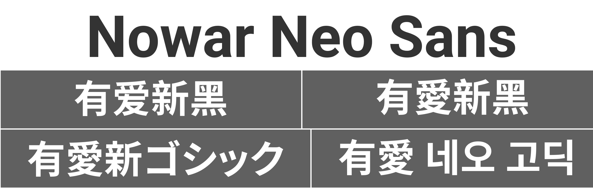
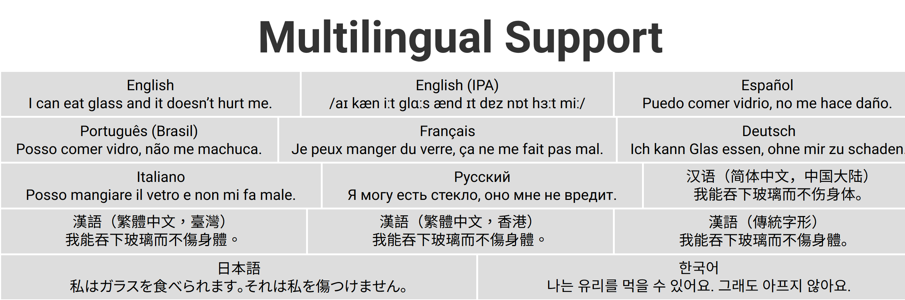

**English** [简体中文](README-Hans.md) [繁體中文](README-Hant.md)

# Nowar Neo Sans for _World of Warcraft_

This is Nowar Neo Sans, font packs for _World of Warcraft_ that support all client languages. Nowar Neo Sans is based on [Roboto](https://github.com/google/roboto) and [Source Han Sans](https://github.com/adobe-fonts/source-han-sans).

> Make Love, Not Warcraft.<br>
> 要有爱，不要魔兽争霸。<br>
> 要愛，不要魔獸。





## Download the Fonts

[Latest release at GitHub](https://github.com/nowar-fonts/Nowar-Neo-Sans/releases)

Mirrors: [Latest release at Gitee](https://gitee.com/nowar-fonts/Nowar-Neo-Sans/releases)

Nowar Neo Sans is shipped in 4 weights and 8 regional variants.

### Weights

* 300: Light
* 400: Regular
* 500: Medium
* 700: Bold

### Regional Variants

CN, TW, HK, JP and KR are “standard variants”, which have full character set support with regional Chinese character orthographies.

|    | European            | 简体中文       | 繁體中文  | 한국어   |
| -- | ------------------- | -------------- | --------- | -------- |
| CN | Mainland China (UI) | Mainland China | Taiwan    | S. Korea |
| TW | Taiwan (UI)         | Mainland China | Taiwan    | S. Korea |
| HK | Hong Kong (UI)      | Mainland China | Hong Kong | S. Korea |
| JP | Japan (UI)          | Mainland China | Taiwan    | S. Korea |
| KR | S. Korea (UI)       | Mainland China | Taiwan    | S. Korea |

CL and OSF are “classical variants”, which have full character set support with classical Chinese character orthography (aka Kāngxī Dictionary forms).

|     | European                        | East Asian |
| --- | ------------------------------- | ---------- |
| CL  | Classical (UI)                  | Classical  |
| OSF | Classical (UI, Oldstyle Figure) | Classical  |

GB is a special offer that supports a superset of Chinese national standard GB 18030-2000. The GB releases are much smaller than standard releases by removing Hangul support.

|    | European            | 中文           | 한국어 |
| -- | ------------------- | -------------- | ------ |
| GB | Mainland China (UI) | Mainland China | N/A    |

* European: English, Español (AL), Português, Deutsch, Español (EU), Français, Italiano, and Русский.
* East Asian: 简体中文, 繁體中文, and 한국어.
* UI: Ambiguous punctations are treated as Western; CJK puctations are half-width; Kana are proportional.

### SharedMedia Font Provider

Nowar Neo Sans is also avialable as an addon (REALLY HUGE!), to register Nowar Neo Sans typeface to SharedMedia.

## How to Build

Dependencies: basic Unix utils, [Python](https://www.python.org/), [otfcc](https://github.com/caryll/otfcc), [otfcc-c2q](https://github.com/caryll/otfcc-cubic2quad) and [7-Zip](https://www.7-zip.org/) (add to `PATH`).

Note: choose 64-bit version if possible. 32-bit version may lead to out-of-memory issue.

Run `configure.py` to generate Makefile. (Optional)
```bash
python configure.py
```

Put Source Han Sans OTF files (all families but HW) and Subset OTF files (CN only) to `shs/`, then just `make` it. 

## Credit

Latin, Greek and Cyrillic characters are from [Roboto](https://github.com/google/roboto) by Google.

CJK Ideographs, Kana and Hangul are from [Source Han Sans](https://github.com/adobe-fonts/source-han-sans) by Adobe.
